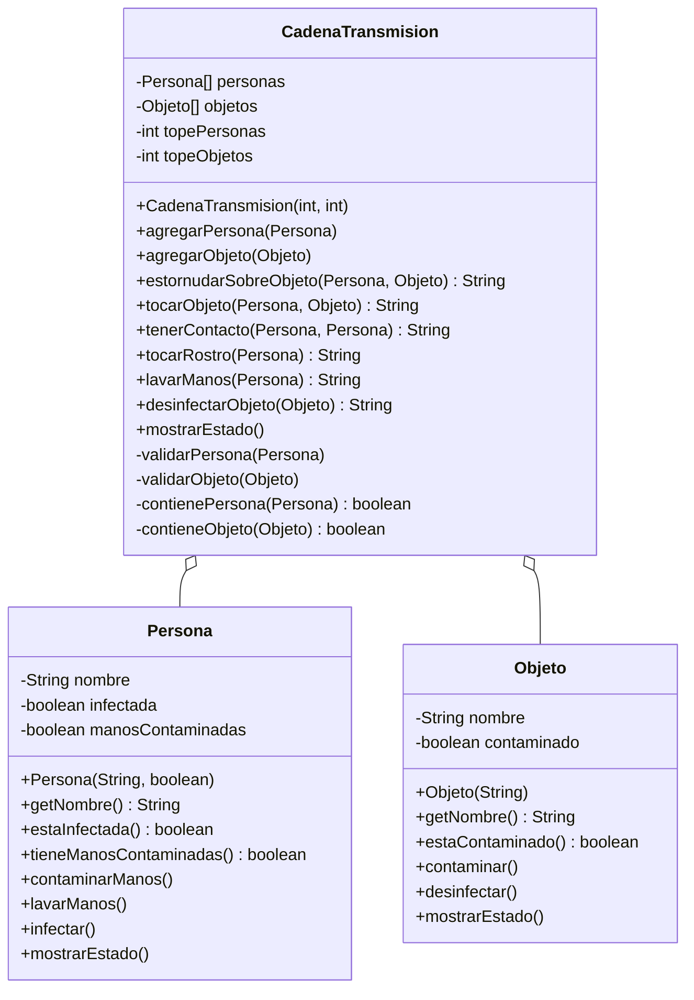

```mermaid
classDiagram
    class Persona {
        -String nombre
        -boolean infectada
        -boolean manosContaminadas
        +Persona(String, boolean)
        +getNombre() String
        +estaInfectada() boolean
        +tieneManosContaminadas() boolean
        +contaminarManos()
        +lavarManos()
        +infectar()
        +mostrarEstado()
    }
    class Objeto {
        -String nombre
        -boolean contaminado
        +Objeto(String)
        +getNombre() String
        +estaContaminado() boolean
        +contaminar()
        +desinfectar()
        +mostrarEstado()
    }
    class CadenaTransmision {
        -Persona[] personas
        -Objeto[] objetos
        -int topePersonas
        -int topeObjetos
        +CadenaTransmision(int, int)
        +agregarPersona(Persona)
        +agregarObjeto(Objeto)
        +estornudarSobreObjeto(Persona, Objeto) String
        +tocarObjeto(Persona, Objeto) String
        +tenerContacto(Persona, Persona) String
        +tocarRostro(Persona) String
        +lavarManos(Persona) String
        +desinfectarObjeto(Objeto) String
        +mostrarEstado()
        -validarPersona(Persona)
        -validarObjeto(Objeto)
        -contienePersona(Persona) boolean
        -contieneObjeto(Objeto) boolean
    }
    CadenaTransmision o-- Persona
    CadenaTransmision o-- Objeto
```
